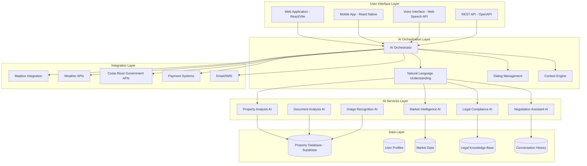

# Guanacaste Real Estate Platform

## 🚀 Deployment Rules (HARDCODED)
- **Production Environment**: Vercel (guanacastereal.com)
- **Deployment Command**: `npm run deploy:vercel`
- **Domain**: guanacastereal.com (existing Vercel project)
- **Never use AWS deployment** for this project
- **Never create duplicate Vercel projects**


> The most advanced AI-powered real estate platform for Costa Rica's Guanacaste region. Commission-free, transparent, and intelligent property transactions.

## 🌟 Overview

Guanacaste Real is revolutionizing Costa Rican real estate by combining cutting-edge AI technology with deep local market expertise. Our platform eliminates traditional real estate commissions while providing unparalleled support through an intelligent AI assistant trained on Costa Rican law, market data, and cultural nuances.

### 🎯 Mission
To democratize property ownership in Costa Rica by removing barriers, providing transparency, and leveraging AI to make informed decisions accessible to everyone.

### 🚀 Key Features

- **🤖 AI Property Assistant**: World-class conversational AI with deep Costa Rican real estate knowledge
- **🏠 Commission-Free Marketplace**: Direct buyer-seller connections with professional oversight
- **📱 Multi-Platform**: Web, mobile, and voice interfaces
- **🌐 Multi-Language**: Full Spanish/English support with Costa Rican dialect recognition
- **📊 Market Intelligence**: Real-time pricing, trends, and investment analysis
- **⚖️ Legal Compliance**: Built-in Costa Rican law expertise and document analysis
- **🔍 Advanced Search**: AI-powered property matching and recommendations
- **💬 Direct Communication**: Secure messaging between all parties
- **📈 Analytics Dashboard**: Comprehensive insights for buyers, sellers, and agents

## 🏗️ Architecture

### System Overview



### Technology Stack

#### Frontend
- **React 18** - Modern React with hooks and concurrent features
- **TypeScript** - Type-safe development
- **Vite** - Lightning-fast build tool and dev server
- **Tailwind CSS** - Utility-first CSS framework
- **React Router** - Client-side routing
- **React Query** - Powerful data synchronization
- **React Hook Form** - Performant forms with easy validation

#### Backend & Database
- **Supabase** - Open source Firebase alternative
- **PostgreSQL** - Advanced relational database
- **Edge Functions** - Serverless functions for AI and business logic
- **Real-time subscriptions** - Live data synchronization

#### AI & ML
- **xAI Grok** - Advanced conversational AI
- **OpenAI GPT-4** - Document analysis and embeddings
- **Custom ML Models** - Property valuation and market prediction
- **Vector Database** - Semantic search and recommendations

#### Integrations
- **Mapbox** - Interactive maps and location services
- **Stripe/PayPal** - Payment processing
- **SendGrid/Twilio** - Communications
- **Costa Rican Government APIs** - Legal and regulatory data

## 🚀 Quick Start

### Prerequisites

- Node.js 18+
- npm or yarn
- Supabase account
- OpenAI API key
- xAI API access

### Installation

1. **Clone the repository**
   ```bash
   git clone https://github.com/your-org/guanacaste-real.git
   cd guanacaste-real
   ```

2. **Install dependencies**
   ```bash
   npm install
   ```

3. **Environment setup**
   ```bash
   cp .env.example .env
   # Edit .env with your API keys and configuration
   ```

4. **Database setup**
   ```bash
   # Initialize Supabase
   npx supabase init
   npx supabase start

   # Run migrations
   npx supabase db push
   ```

5. **Seed data**
   ```bash
   npm run seed:demo
   ```

6. **Start development server**
   ```bash
   npm run dev
   ```

### Development Workflow

```bash
# Install new dependencies
npm install <package-name>

# Run tests
npm test

# Build for production
npm run build

# Run linting
npm run lint

# Type checking
npm run type-check
```

## 📁 Project Structure

```
guanacaste-real/
├── apps/
│   └── web/                    # Main web application
│       ├── src/
│       │   ├── components/     # Reusable UI components
│       │   ├── pages/         # Page components
│       │   ├── contexts/      # React contexts
│       │   ├── services/      # API services
│       │   ├── lib/           # Utilities and configurations
│       │   └── routes/        # Routing configuration
│       ├── public/            # Static assets
│       └── package.json
├── packages/                   # Shared packages
│   ├── ui/                    # Design system components
│   └── lib/                   # Shared utilities
├── functions/                  # Supabase edge functions
│   ├── ai/                    # AI processing functions
│   ├── search/                # Search and filtering
│   ├── payments/              # Payment processing
│   └── messaging/             # Communication functions
├── supabase/                   # Supabase configuration
│   ├── migrations/            # Database migrations
│   ├── functions/             # Edge functions
│   └── config.toml           # Supabase configuration
├── scripts/                    # Automation scripts
├── seed/                      # Seed data
└── content/                   # Content management
```

## 🔧 Configuration

### Environment Variables

Create a `.env` file with the following variables:

```env
# Supabase
VITE_SUPABASE_URL=your_supabase_url
VITE_SUPABASE_ANON_KEY=your_supabase_anon_key
SUPABASE_SERVICE_ROLE_KEY=your_service_role_key

# AI Services
OPENAI_API_KEY=your_openai_key
XAI_API_KEY=your_xai_key

# External APIs
MAPBOX_ACCESS_TOKEN=your_mapbox_token
STRIPE_PUBLISHABLE_KEY=your_stripe_key
SENDGRID_API_KEY=your_sendgrid_key

# Application
VITE_APP_ENV=development
VITE_APP_URL=http://localhost:5173
```

### Database Schema

The application uses the following main tables:

- `properties` - Property listings with full metadata
- `users` - User profiles and authentication
- `conversations` - AI assistant conversation history
- `market_data` - Real estate market analytics
- `legal_documents` - Legal knowledge base
- `transactions` - Property transaction records

## 🧪 Testing

### Running Tests

```bash
# Run all tests
npm test

# Run tests in watch mode
npm run test:watch

# Run tests with coverage
npm run test:coverage

# Run E2E tests
npm run test:e2e
```

### Test Structure

```
src/
├── __tests__/              # Unit tests
├── __integration__/        # Integration tests
└── __e2e__/               # End-to-end tests
```

## 🚀 Deployment

### Production Build

```bash
npm run build:production
```

### Vercel Deployment

```bash
npm run deploy:vercel
```

### Environment Configuration

- **Development**: Local development environment
- **Staging**: Pre-production testing environment
- **Production**: Live user-facing environment

## 📊 Monitoring & Analytics

### Application Monitoring

- **Sentry**: Error tracking and performance monitoring
- **Vercel Analytics**: User behavior and performance metrics
- **Supabase Dashboard**: Database performance and usage

### Business Metrics

- User acquisition and retention
- Property transaction volume
- AI assistant usage and satisfaction
- Market data accuracy and timeliness

## 🔒 Security

### Data Protection

- End-to-end encryption for sensitive communications
- GDPR and Costa Rican data protection compliance
- Regular security audits and penetration testing
- Secure API key management and rotation

### Access Control

- Role-based access control (Buyer, Seller, Realtor, Admin)
- Multi-factor authentication for sensitive operations
- Audit logging for all user actions
- Rate limiting and abuse prevention

## 🤝 Contributing

### Development Guidelines

1. **Code Style**: Follow ESLint and Prettier configurations
2. **Testing**: Write tests for all new features
3. **Documentation**: Update documentation for API changes
4. **Security**: Follow security best practices
5. **Performance**: Optimize for performance and accessibility

### Pull Request Process

1. Create a feature branch from `main`
2. Write tests for your changes
3. Ensure all tests pass
4. Update documentation if needed
5. Submit a pull request with a clear description

### Code Review Checklist

- [ ] Tests written and passing
- [ ] Code follows style guidelines
- [ ] Documentation updated
- [ ] Security considerations addressed
- [ ] Performance impact assessed

## 📈 Roadmap

### Phase 1: Foundation (Current)
- [x] Core platform architecture
- [x] AI assistant MVP
- [ ] Real data integration
- [ ] Testing framework
- [ ] Documentation

### Phase 2: Feature Completion
- [ ] Advanced AI features
- [ ] Complete user dashboards
- [ ] Messaging system
- [ ] Property management

### Phase 3: Production Ready
- [ ] Performance optimization
- [ ] Security hardening
- [ ] Monitoring and analytics
- [ ] Content management

### Phase 4: Scale & Launch
- [ ] Mobile applications
- [ ] Third-party integrations
- [ ] Advanced analytics
- [ ] Global expansion

## 📞 Support

### Getting Help

- **Documentation**: [docs.guanacastereal.com](https://docs.guanacastereal.com)
- **Issues**: [GitHub Issues](https://github.com/your-org/guanacaste-real/issues)
- **Discussions**: [GitHub Discussions](https://github.com/your-org/guanacaste-real/discussions)
- **Email**: support@guanacastereal.com

### Community

- **Discord**: Join our developer community
- **Twitter**: Follow for updates and insights
- **Blog**: Technical articles and market insights

## 📄 License

This project is proprietary software. All rights reserved.

## 🙏 Acknowledgments

- Costa Rican real estate community
- Open source contributors
- AI research community
- Local government and regulatory bodies

---

**Built with ❤️ for the Costa Rican real estate community**

*Transforming how people buy and sell property in Guanacaste through AI-powered transparency and intelligence.*