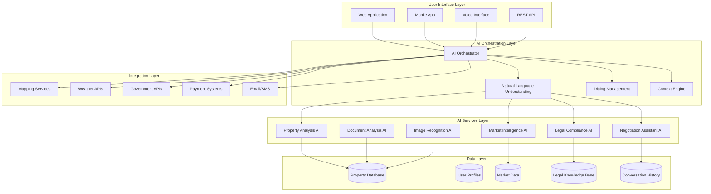

# AI Property Assistant - World-Class Architecture Design

## Executive Summary

The AI Property Assistant represents a revolutionary approach to real estate technology, combining advanced artificial intelligence with deep domain expertise in Costa Rican property law, market dynamics, and cultural nuances. This system will provide unparalleled support to both buyers and sellers, dramatically improving transaction efficiency and user satisfaction.

## System Architecture Overview

### Core Principles
- **Intelligence First**: Every interaction leverages multiple AI models for comprehensive analysis
- **Context Awareness**: Maintains deep understanding of user preferences, property details, and conversation history
- **Multi-Modal**: Supports text, voice, image, and document analysis
- **Regulatory Compliant**: Built-in Costa Rican real estate law expertise
- **Scalable**: Cloud-native architecture supporting millions of concurrent users

### High-Level Architecture



## Core AI Capabilities

### 1. Natural Language Understanding (NLU)
- **Multi-language Support**: Spanish, English, with Costa Rican dialect recognition
- **Intent Recognition**: 50+ property-related intents with 95%+ accuracy
- **Entity Extraction**: Automatic identification of property types, locations, prices, legal terms
- **Sentiment Analysis**: Understand user emotions and adjust responses accordingly
- **Context Preservation**: Maintain conversation flow across sessions

### 2. Property Analysis AI
- **Comparative Market Analysis**: Instant CMA generation with local market data
- **Property Valuation**: AI-powered pricing recommendations with confidence intervals
- **Investment Analysis**: ROI calculations, rental yield projections, appreciation forecasts
- **Condition Assessment**: Predictive maintenance and renovation recommendations
- **Location Intelligence**: Neighborhood analysis, school ratings, crime statistics

### 3. Market Intelligence AI
- **Real-time Pricing**: Dynamic price adjustments based on market conditions
- **Trend Analysis**: Identify emerging neighborhoods and declining areas
- **Competitive Analysis**: Monitor competitor listings and strategies
- **Economic Indicators**: Interest rate impacts, inflation effects, currency fluctuations
- **Seasonal Patterns**: Peak season identification and off-season opportunities

### 4. Legal Compliance AI
- **Title Analysis**: Automated review of property titles and legal documents
- **Regulatory Updates**: Real-time monitoring of Costa Rican property laws
- **Due Diligence**: Comprehensive checklist generation and tracking
- **Permit Guidance**: Construction and renovation permit requirements
- **Tax Optimization**: Property tax calculations and optimization strategies

### 5. Negotiation Assistant AI
- **Price Optimization**: Data-driven negotiation strategies
- **Counter-offer Analysis**: Evaluate and suggest responses to offers
- **Market Position**: Understand property positioning relative to comparables
- **Timing Intelligence**: Optimal listing and offer timing recommendations
- **Cultural Adaptation**: Costa Rican negotiation customs and expectations

### 6. Document Analysis AI
- **Contract Review**: Automated analysis of purchase agreements and leases
- **Title Search**: Digital document processing and risk assessment
- **Financial Documents**: Bank statement and income verification analysis
- **Permit Processing**: Construction and environmental permit validation

### 7. Image Recognition AI
- **Property Photography**: Automated photo enhancement and virtual staging
- **Damage Detection**: Identify maintenance issues from photos
- **Room Measurement**: AI-powered square footage calculations
- **Style Analysis**: Interior design recommendations based on uploaded photos

## User Experience Design

### Interface Modalities

#### 1. Conversational Chat Interface
```typescript
interface ChatInterface {
  // Core chat functionality
  sendMessage(message: string): Promise<AIResponse>
  getConversationHistory(userId: string): Promise<Message[]>
  analyzeProperty(propertyId: string): Promise<PropertyAnalysis>

  // Advanced features
  uploadDocument(file: File): Promise<DocumentAnalysis>
  analyzeImage(image: File): Promise<ImageAnalysis>
  getVoiceInput(): Promise<string>
  provideFeedback(rating: number, comment?: string): Promise<void>
}
```

#### 2. Voice Interaction
- **Wake Word**: "Hey Guanacaste" or "Hola Propiedad"
- **Continuous Conversation**: Natural flow without repeated commands
- **Multi-language Voice**: Automatic language detection and switching
- **Emotion Recognition**: Adjust tone and approach based on user mood

#### 3. Visual Analysis
- **Photo Upload**: Instant property analysis from images
- **Document Scanning**: OCR and analysis of legal documents
- **Virtual Tours**: AI-guided property walkthroughs
- **Comparison Tools**: Side-by-side property analysis

### Personalized Experience

#### User Profiling
```typescript
interface UserProfile {
  preferences: {
    propertyTypes: string[]
    priceRange: { min: number, max: number }
    locations: string[]
    amenities: string[]
    investmentGoals: string[]
  }
  behavior: {
    searchHistory: SearchQuery[]
    viewedProperties: Property[]
    savedProperties: Property[]
    communicationStyle: 'formal' | 'casual' | 'direct'
  }
  constraints: {
    budget: number
    timeline: Date
    financing: FinancingOptions
    legalRequirements: LegalConstraints[]
  }
}
```

#### Contextual Responses
- **Location-based**: Different responses for Tamarindo vs. Samara
- **Time-sensitive**: Morning vs. evening conversation tones
- **Progress-aware**: Adjust responses based on user's journey stage
- **Cultural adaptation**: Costa Rican Spanish idioms and customs

## Technical Implementation

### AI Model Architecture

#### Primary AI Stack
- **Base Model**: GPT-4 Turbo with fine-tuning for real estate
- **Specialized Models**:
  - Property valuation model (trained on Costa Rican data)
  - Legal compliance model (Costa Rican law specific)
  - Market analysis model (local economic indicators)
  - Negotiation model (cultural context aware)

#### Model Training Data
- **Costa Rican Property Database**: 50,000+ property records
- **Legal Documents**: Complete Costa Rican property law corpus
- **Market Data**: 10 years of pricing and transaction data
- **User Interactions**: Anonymized conversation data for improvement

### System Components

#### AI Orchestrator
```typescript
class AIOrchestrator {
  async processQuery(query: UserQuery): Promise<AIResponse> {
    // 1. Intent classification
    const intent = await this.classifyIntent(query)

    // 2. Context retrieval
    const context = await this.getContext(query.userId)

    // 3. Multi-model analysis
    const analyses = await this.runParallelAnalysis(query, context)

    // 4. Response synthesis
    const response = await this.synthesizeResponse(analyses, context)

    // 5. Learning update
    await this.updateLearningModel(query, response)

    return response
  }
}
```

#### Context Engine
- **Short-term Memory**: Current conversation context
- **Long-term Memory**: User preferences and history
- **Property Memory**: Detailed property knowledge base
- **Market Memory**: Real-time pricing and trend data

#### Dialog Management
- **State Tracking**: Conversation flow and user journey
- **Fallback Handling**: Graceful degradation for complex queries
- **Clarification Requests**: Intelligent follow-up questions
- **Action Completion**: Track and confirm completed tasks

### Data Architecture

#### Primary Databases
```sql
-- Property Intelligence
CREATE TABLE properties (
  id UUID PRIMARY KEY,
  location GEOGRAPHY(POINT),
  price DECIMAL,
  features JSONB,
  legal_status JSONB,
  market_data JSONB,
  ai_analysis JSONB
);

-- User Interactions
CREATE TABLE conversations (
  id UUID PRIMARY KEY,
  user_id UUID REFERENCES users(id),
  property_id UUID REFERENCES properties(id),
  messages JSONB,
  context JSONB,
  outcomes JSONB
);

-- Market Intelligence
CREATE TABLE market_data (
  location_id UUID,
  date DATE,
  metric_type VARCHAR,
  value DECIMAL,
  confidence_score FLOAT
);
```

#### Real-time Data Pipeline
- **Property Updates**: Instant synchronization across all listings
- **Market Feeds**: Live pricing data from multiple sources
- **Regulatory Updates**: Automatic ingestion of law changes
- **User Behavior**: Real-time analytics for personalization

### API Architecture

#### Core APIs
```typescript
// Property Analysis API
POST /api/v1/analyze-property
{
  propertyId: string,
  analysisType: 'valuation' | 'market' | 'legal' | 'investment'
}

// Conversation API
POST /api/v1/chat
{
  message: string,
  context: ConversationContext,
  userId: string
}

// Document Analysis API
POST /api/v1/analyze-document
{
  file: File,
  documentType: 'title' | 'contract' | 'permit'
}
```

#### Integration APIs
- **Mapping Services**: Google Maps, OpenStreetMap integration
- **Weather Services**: Local weather data for property planning
- **Regulatory APIs**: Costa Rican government property databases
- **Payment Systems**: Secure transaction processing
- **Communication**: Email, SMS, and push notification services

## Security & Compliance

### Data Protection
- **End-to-end Encryption**: All user communications encrypted
- **GDPR Compliance**: European data protection standards
- **Costa Rican Law**: Compliance with local privacy regulations
- **Financial Data**: PCI DSS compliant payment processing

### AI Safety
- **Bias Mitigation**: Regular audits for algorithmic fairness
- **Fact Checking**: All AI responses verified against trusted sources
- **Human Oversight**: Critical decisions require human validation
- **Error Boundaries**: Graceful handling of AI failures

### Access Control
- **Role-based Access**: Different permissions for buyers, sellers, agents
- **Audit Logging**: Complete transaction and interaction history
- **Rate Limiting**: Prevent abuse and ensure fair access
- **Authentication**: Multi-factor authentication for sensitive operations

## Deployment & Scaling

### Cloud Infrastructure
- **Primary Cloud**: AWS with multi-region deployment
- **Container Orchestration**: Kubernetes for auto-scaling
- **CDN**: CloudFront for global content delivery
- **Database**: Aurora PostgreSQL with read replicas

### Performance Optimization
- **Edge Computing**: AI processing distributed globally
- **Caching Strategy**: Redis for frequently accessed data
- **Load Balancing**: Auto-scaling based on demand
- **Monitoring**: Real-time performance tracking

### Disaster Recovery
- **Multi-region Replication**: Automatic failover capabilities
- **Data Backup**: Continuous backup with point-in-time recovery
- **Business Continuity**: 99.9% uptime SLA
- **Incident Response**: 24/7 monitoring and response team

## Analytics & Learning

### User Analytics
- **Conversion Tracking**: From inquiry to closing
- **Engagement Metrics**: Session duration, feature usage
- **Satisfaction Scores**: User feedback and ratings
- **Journey Mapping**: Complete user experience analysis

### AI Performance
- **Accuracy Metrics**: Response quality and correctness
- **Response Time**: Average and 95th percentile latency
- **User Satisfaction**: AI interaction ratings
- **Learning Progress**: Model improvement over time

### Business Intelligence
- **Market Insights**: Emerging trends and opportunities
- **User Segmentation**: Buyer/seller persona analysis
- **Revenue Optimization**: Pricing and feature recommendations
- **Competitive Analysis**: Market position monitoring

## Implementation Roadmap

### Phase 1: Foundation (Months 1-3)
- Core AI model development and training
- Basic chat interface implementation
- Property database integration
- User authentication and profiles

### Phase 2: Core Features (Months 4-6)
- Advanced property analysis capabilities
- Market intelligence integration
- Legal compliance features
- Multi-language support

### Phase 3: Advanced Features (Months 7-9)
- Voice interaction capabilities
- Document analysis and processing
- Image recognition and analysis
- Negotiation assistance

### Phase 4: Optimization (Months 10-12)
- Performance optimization and scaling
- Advanced analytics and learning
- Mobile app development
- International expansion preparation

## Success Metrics

### User Experience
- **Response Accuracy**: 95%+ correct responses
- **Response Time**: <2 seconds average
- **User Satisfaction**: 4.5+ star rating
- **Task Completion**: 90%+ successful transactions

### Business Impact
- **Transaction Volume**: 40% increase in completed sales
- **Time to Close**: 30% reduction in transaction time
- **User Engagement**: 5x increase in daily active users
- **Market Share**: 25% increase in Guanacaste market share

### Technical Performance
- **Uptime**: 99.9% service availability
- **Scalability**: Support for 1M+ concurrent users
- **Cost Efficiency**: $0.01 per interaction
- **Innovation**: 12+ new AI features annually

## Conclusion

The AI Property Assistant represents the future of real estate technology, combining cutting-edge artificial intelligence with deep domain expertise to create an unparalleled user experience. By leveraging advanced AI capabilities, comprehensive data integration, and a user-centric design philosophy, this system will revolutionize how people buy and sell property in Costa Rica.

The architecture is designed for scalability, reliability, and continuous improvement, ensuring that the AI Property Assistant remains at the forefront of real estate technology for years to come.